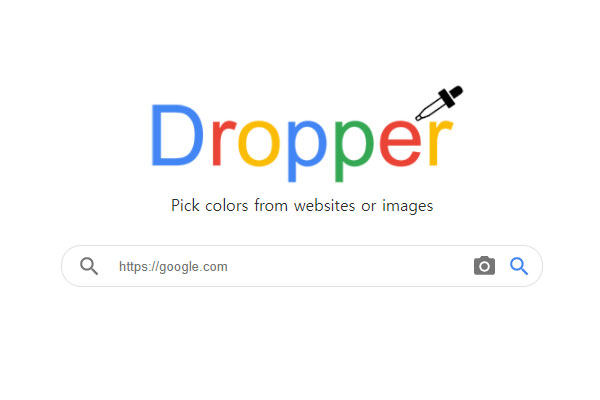

# Color Dropper

It is a tool application to pick color from any website or pictures.

It is implemented with pure JavaScript from the scratch, because I wanted to try to make a web application without any library or framework.

[https://colordropper.netlify.app/](https://colordropper.netlify.app/)
